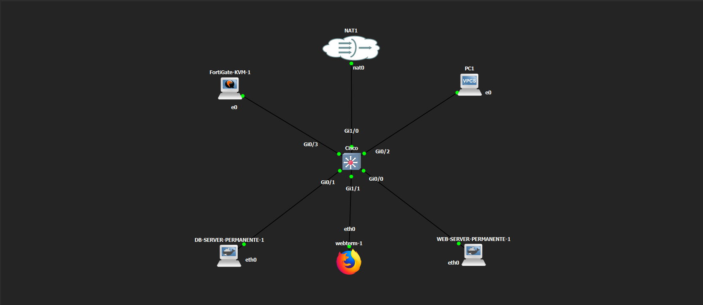
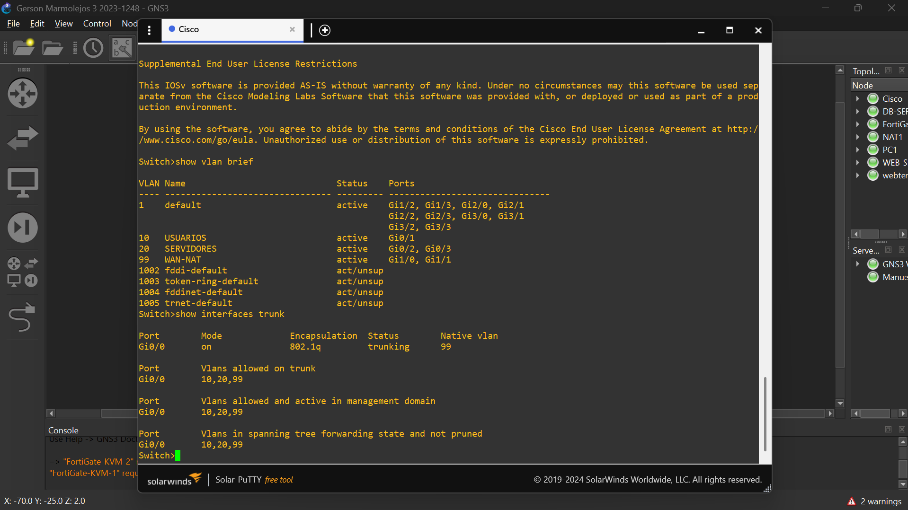

# Infraestructura 2 - FortiGate, NAT y Control de Acceso

Laboratorio de seguridad en GNS3 utilizando FortiGate para segmentar una red de usuarios y servidores, controlar el acceso mediante políticas de firewall y publicar un servidor web HTTPS mediante NAT/VIP.

## 🎥 Video demostrativo
https://itlaedudo.sharepoint.com/:v:/s/Pratica/IQBJkP0zugAVQ5_01vwWvms3AaFfgD6Res3KbkynR6LBHgQ?e=cXabsG&nav=eyJyZWZlcnJhbEluZm8iOnsicmVmZXJyYWxBcHAiOiJTdHJlYW1XZWJBcHAiLCJyZWZlcnJhbFZpZXciOiJTaGFyZURpYWxvZy1MaW5rIiwicmVmZXJyYWxBcHBQbGF0Zm9ybSI6IldlYiIsInJlZmVycmFsTW9kZSI6InZpZXcifX0%3D

---

## 📌 Propósito del laboratorio

El objetivo de esta infraestructura fue implementar diferentes controles de seguridad utilizando FortiGate.

La red fue segmentada mediante VLAN para separar los usuarios de los servidores y controlar qué servicios pueden utilizarse entre ambas redes.

También se configuró la publicación de un servidor web HTTPS mediante un Virtual IP y se aplicaron políticas específicas para permitir el acceso al servidor web y bloquear el acceso directo de los usuarios al servidor de base de datos.

---

## 🖥️ Topología

La infraestructura está formada por:

- 1 FortiGate
- 1 switch Cisco
- 1 PC de usuario
- 1 WEB-SERVER
- 1 DB-SERVER
- 1 nodo NAT
- Webterm para pruebas y administración

### Diagrama de la topología

---

## 🌐 Segmentación de red

### VLAN 10 - Usuarios

Red:

`10.12.48.0/25`

Gateway:

`10.12.48.1`

PC1:

`10.12.48.2/25`

---

### VLAN 20 - Servidores

Red:

`10.12.48.128/28`

Gateway:

`10.12.48.129`

WEB-SERVER:

`10.12.48.130/28`

DB-SERVER:

`10.12.48.131/28`

---

### VLAN 99 - WAN / NAT

Esta VLAN se utiliza para comunicar FortiGate con la red externa simulada mediante el nodo NAT.

La interfaz WAN de FortiGate obtiene su dirección mediante DHCP.

Durante las pruebas finales utilizó:

`192.168.42.24/24`

---

## 🔀 Configuración del switch Cisco

El switch Cisco se utiliza para transportar las VLAN de la infraestructura.

El enlace hacia FortiGate fue configurado como trunk utilizando 802.1Q.

Por el trunk se permiten:

- VLAN 10
- VLAN 20
- VLAN 99

La VLAN 99 se configuró como VLAN nativa.

### Evidencia

---

## 🔌 Interfaces de FortiGate

FortiGate utiliza subinterfaces VLAN sobre `port1`.

Las principales interfaces son:

- `port1` → WAN mediante DHCP
- `VLAN10-USR` → `10.12.48.1/25`
- `VLAN20-SRV` → `
